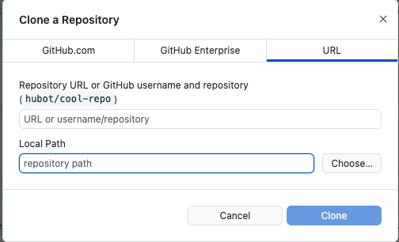

# Développez des applications avec JavaScript et NodeJS

Bienvenue sur le code source du projet fil rouge **Guess the Number**. Ce projet a été réalisé en lien avec le cours **Développez des applications avec JavaScript et NodeJS** sur [NX](https://nx.academy).

Ce cours ainsi que son projet fil rouge ont été écrits, développés et testés sur Mac et Windows. Ce projet est **open source**. Si vous avez une question, que vous avez trouvé une faute d'orthographe ou que quelque chose ne vous semble pas clair, nous vous invitons à ouvrir une [issue]().

## Prérequis

- [NodeJS](https://nodejs.org/en/) : ce projet utilise actuellement la version LTS de Node, soit la 18. Pour l'installer, veuillez vous referez au chapitre 1 de la partie 1 du cours. Vous verrez comment installer NodeJS sur Mac et Windows.
- [Visual Studio Code](https://code.visualstudio.com/) : Visual Studio Code est notre éditeur de texte durant tout le cours. Pour l'installer, veuillez vous referez au chapitre 2 de la partie 1 du cours. Vous verrez comment installer VSCode sur Mac et Windows.
- [GitHub Desktop](https://desktop.github.com/) : nous nous servons de GitHub Desktop pour cloner le projet depuis GitHub ainsi que pour changer de branche tout au long du cours. Pour le cloner, veuillez vous referez au chapitre 3 de la partie 1 du cours. Vous verrez comment installer GitHub Desktop sur Mac et Windows.

## Installation

### Avec GitHub Desktop

Ouvrez GitHub Desktop et cliquez sur le bouton **Clone Repository**. Une fois, la modale ouverte, cliquez sur l'onglet URL. Renseignez ensuite le nom de votre repository et le répertoire d'installation. Nous vous montrons ces étapes dans le chapitre 3 de la partie 1 du cours



### En ligne de commandes

Pour récupérer ce projet, vous pouvez simplement réaliser un `git clone` :

- Via SSH
```
git@github.com:nx-academy/Developpez-des-applications-avec-JavaScript-et-NodeJS.git
```

- Via HTTPS
```
https://github.com/nx-academy/Developpez-des-applications-avec-JavaScript-et-NodeJS.git
```

## Informations complémentaires:

À partir de la partie 2, chaque chapitre comporte entre deux et trois branches :
- `partie-2/chapitre-2-debut` - correspond à la branche du début de chaque chapitre
- `partie-2/chapitre-2-exercice` - (**optionnel**) correspond à la branche d'activité
- `partie-2/chapitre-2-fin` - correspond à la branche de fin de chapitre.
